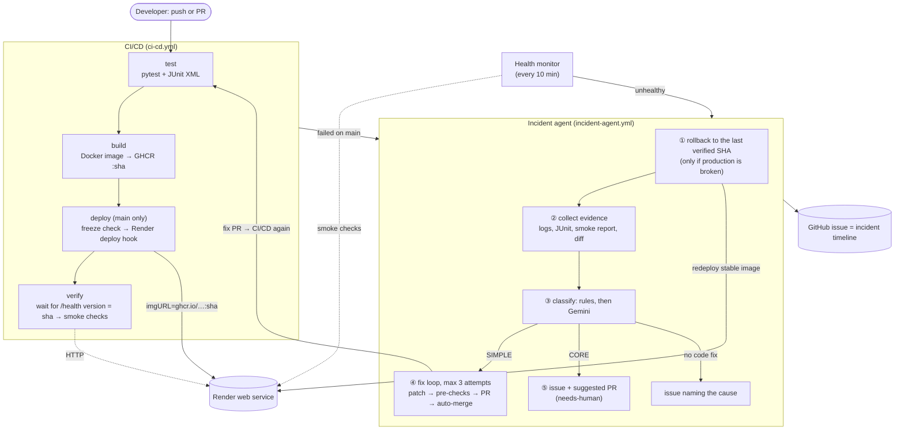

# Autonomous CI/CD Incident Response Agent

*Automated failure diagnosis and remediation for a CI/CD pipeline.*

A small FastAPI to-do app goes through a complete pipeline: GitHub → pytest → Docker image on GHCR →
GitHub Actions → Render. On top of the pipeline sits an **incident agent**, a set of Python scripts run by
GitHub Actions. When something breaks it follows one rule: **first get back to the last stable version,
then find out what broke, then fix it, or hand it to a human with a suggested fix.** Rollback and
classification are plain rules, so they keep working when the LLM is unavailable. Gemini is used only to
refine the diagnosis and to write patches, and every patch is tested in the runner before it can get near
production.

## Course requirements

| Requirement | Where it is done |
|---|---|
| Version control (Git/GitHub) | This repo, conventional commits, PRs (the agent opens PRs too) |
| Application build | FastAPI app (`app/`) packaged as a Docker image |
| Automated testing | pytest for the app and the agent in CI (`tests/`, `agent/tests/`), smoke checks against the live app (`agent/smoke.py`) |
| Containerization (Docker) | [`Dockerfile`](Dockerfile), image pushed to GHCR, tagged with the commit SHA |
| CI/CD (GitHub Actions) | [`ci-cd.yml`](.github/workflows/ci-cd.yml), [`incident-agent.yml`](.github/workflows/incident-agent.yml), [`health-monitor.yml`](.github/workflows/health-monitor.yml) |
| Deployment | Render web service, deployed by a deploy hook with an exact image |
| Documentation + demo | This README, [`PLAN.md`](PLAN.md), [`docs/API.md`](docs/API.md), [`scenarios/`](scenarios/README.md), incident issues, [demo script](#demo-script) |

## Architecture



## How an incident is handled

**Triggers.** The incident agent wakes up when the `CI/CD` workflow fails on `main`, or when the health
monitor finds the live app unhealthy.

| Trigger | What it means | Production broken? |
|---|---|---|
| `test` or `build` failed | The broken commit was never deployed | No: go straight to fixing |
| `deploy` or `verify` failed | The new version is live and broken, or never came up | Yes: **roll back first** |
| Health monitor failed | The live app went unhealthy outside a deploy | Yes: **roll back first** |

**① Rollback first.** "Last stable" is the newest `CI/CD` run on `main` whose `verify` job succeeded
(a skipped `verify` never counts). The agent calls the Render deploy hook with that commit's image, waits
until `/health` reports that commit, then runs the smoke checks. Rollback never needs Gemini. If the
rollback itself fails, automation stops and a `rollback-failed` / `needs-human` issue is opened.

**② Evidence.** Failed job logs (the tail around the first error), JUnit failures, the verify smoke
report, the diff between the stable and the broken commit, and the files involved. Secrets are masked
before anything is sent to Gemini or written to an issue.

**③ SIMPLE vs CORE.** Rules decide first; Gemini can only make the decision safer (SIMPLE → CORE), never
the other way. After a patch is written it is checked again: a "SIMPLE" fix that changes function logic in
`app/` is upgraded to CORE.

| SIMPLE: the agent fixes and merges | CORE: the agent only suggests |
|---|---|
| Missing/wrong dependency, Dockerfile mistakes, config/env defaults, syntax errors, missing imports, typos | Wrong endpoint logic, routing, DB logic, validation/business rules, fixes over 30 lines or across several functions |

**④ Fix loop (SIMPLE, max 3 attempts).** Gemini writes a search/replace patch. In the runner, on a copy of
the repo: apply it → pytest → `docker build` → run the container → smoke checks. A failed pre-check counts
as an attempt and its error goes into the next prompt; nothing is deployed. A passing patch becomes a PR on
`agent/fix-<incident>-<n>` with auto-merge, if confidence ≥ 0.8. CI runs on it, it merges, deploys and is
verified, and then the incident closes. If it fails live, the agent rolls back again (another attempt).
After 3 failed attempts: the best attempt is opened as an unmerged `needs-human` PR.

**⑤ CORE path.** No auto-merge. The agent still has Gemini write a fix, runs the same pre-checks, and
opens an issue plus a `needs-human` PR that says whether the pre-checks passed.

**Deploy freeze.** After a rollback, `main` still contains the broken commit. While an issue labelled
`incident:active` is open, the `deploy` job deploys only commits that come from the agent's fix PRs; other
pushes are tested and built but not deployed. Closing the incident lifts the freeze.

**Guardrails.**
- The agent never pushes to `main`: everything goes through a PR and the required checks.
- Patches may only touch `app/`, `requirements*.txt`, `Dockerfile`, `.dockerignore` and config files.
  A patch that touches `tests/`, `.github/`, `agent/` or `scenarios/` is rejected.
- Loop guard: failures on `agent/*` branches never open a new incident.
- One incident at a time (a shared `concurrency` group).
- Every incident has one GitHub issue that holds the whole timeline.
- **Kill switches** (repository variables, `false` = off): `AGENT_ENABLED`, `AGENT_AUTO_MERGE`, `AGENT_ROLLBACK`.

| Failure | Scenario | Agent action |
|---|---|---|
| Test fails on an import, syntax error or typo | S1–S4 | Fix → PR → auto-merge → deploy |
| Docker build fails | S5 | Fix the Dockerfile → PR → auto-merge |
| Passes CI, breaks only when deployed | S6–S9 | **Rollback** → fix → PR → auto-merge |
| Tests fail on assertions (wrong behaviour) | C1–C8 | Issue + suggested PR, waits for a human |
| Missing secret, Render or quota problem | N1 | Issue naming the cause, no code change |
| App down without a code change | N2 | Rollback (redeploy) → issue, which closes itself when healthy again |
| Flaky CI infrastructure (registry timeouts, …) | – | Re-run the failed jobs once |
| No safe fix found | E1 | Up to 3 attempts → issue + unmerged PR, stable version stays live |
| Only "fix" would be editing a test | E2 | Patch rejected |
| Unrelated push during an incident | E3 | Deploy skipped (freeze) |

## Repository layout

```
├── app/                    FastAPI app: main.py (routes), db.py (SQLite), status.py, clock.py, seed.py
│   └── static/index.html   the page (Tailwind CDN + plain JS)
├── tests/                  pytest for the app
├── agent/                  the incident agent
│   ├── main.py             entry point: rollback → collect → classify → fix / hand over
│   ├── smoke.py            smoke checks (+ wait for the expected version)
│   ├── rollback.py         last stable SHA, redeploy, verify
│   ├── freeze.py           deploy freeze check (used by ci-cd.yml)
│   ├── collect.py          evidence: logs, JUnit, smoke report, diff, files; secret masking
│   ├── classify.py         rules: category + SIMPLE/CORE; patch-based CORE upgrade
│   ├── llm.py              Gemini client: JSON schema, throttle, retries
│   ├── fix.py patching.py  fix loop, in-runner pre-checks, guardrails
│   ├── github_api.py notify.py report.py   issues, PRs, labels, auto-merge, incident report
│   ├── eval.py             scenario eval harness
│   └── tests/              unit tests for the agent
├── scenarios/              failure scenarios (S*, C*, N*, E*) as JSON + README
├── docs/API.md             API contract
├── .github/workflows/      ci-cd.yml, incident-agent.yml, health-monitor.yml
├── Dockerfile  .dockerignore  .env.example
└── requirements.txt  requirements-dev.txt  requirements-agent.txt
```

## Run locally

Requires Python 3.12+.

```bash
python -m venv .venv
source .venv/bin/activate            # Windows: .venv\Scripts\activate
pip install -r requirements-dev.txt -r requirements-agent.txt
uvicorn app.main:app --reload        # open http://localhost:8000
```

The app is configured by environment variables (all optional, see [`.env.example`](.env.example)):
`DATABASE_PATH` (default `./todos.db`), `APP_TIMEZONE` (default `Asia/Kolkata`), `PORT` (container only)
and `APP_VERSION` (set by the image build). The demo todos are seeded whenever the database is empty.

**Tests** (app + agent, 330+ tests, no network needed):

```bash
python -m pytest
```

**Docker:**

```bash
docker build --build-arg APP_VERSION=$(git rev-parse HEAD) -t todo .
docker run --rm -p 8000:8000 todo                      # or: --env-file .env
python -m agent.smoke --url http://localhost:8000      # the same checks the pipeline runs
```

The image runs as a non-root user, listens on `$PORT` (8000 by default; Render sets its own), keeps the
SQLite file in `/app/data` and has a `HEALTHCHECK` on `/health`.

## One-time setup

Do these in order. The first deploy is expected to fail until Render exists.

**1. GitHub repository.** Create a repository (public is simplest: free Actions minutes and a free public
image) and push this code to `main`. Before the first push, add the repository **variable**
`AGENT_ENABLED=false` (Settings → Secrets and variables → Actions → Variables), so the expected first
failure does not open an incident.

**2. First pipeline run.** The push runs `CI/CD`: `test` and `build` pass and the image is pushed to
`ghcr.io/<owner>/<repo>:<sha>` and `:latest`. `deploy` fails with `RENDER_DEPLOY_HOOK_URL is not set`.
That's expected.

**3. Image visibility.** On your GitHub profile → Packages → the new package → Package settings → Change
visibility → **Public** (new packages are usually private; the alternative is to give Render registry
credentials).

**4. Render web service.** New → Web Service → **Existing image** → `ghcr.io/<owner>/<repo>:latest`
(lowercase) → Free instance. Then:
- Health check path: `/health`
- Auto-deploy: **off** if Render offers it (the pipeline deploys exact images through the hook)
- Environment variables: none needed. `APP_TIMEZONE` is optional. Don't set `DATABASE_PATH`
  (the image already stores the database in its data dir, and scenario S7 relies on it being unset).
- Settings → **Deploy Hook**: copy the URL (it contains a secret key).

**5. Secrets and variables** (Settings → Secrets and variables → Actions):

| Name | Kind | Value |
|---|---|---|
| `RENDER_DEPLOY_HOOK_URL` | secret | The Render deploy hook URL |
| `GEMINI_API_KEY` | secret | Key from [Google AI Studio](https://aistudio.google.com/apikey) |
| `AGENT_TOKEN` | secret | Fine-grained PAT, see below |
| `RENDER_APP_URL` | variable | `https://<service>.onrender.com` (no trailing slash) |
| `AGENT_MODEL` | variable, optional | Gemini model (default in `agent/llm.py`) |
| `AGENT_LLM_RPM` | variable, optional | Client-side Gemini requests per minute (default 5) |
| `AGENT_ENABLED`, `AGENT_AUTO_MERGE`, `AGENT_ROLLBACK` | variables, optional | Kill switches: `false` turns the feature off |

**`AGENT_TOKEN`:** GitHub → Settings → Developer settings → Fine-grained tokens → *Only select
repositories*: this repo. Repository permissions, all **Read and write**: **Contents** (fix branches,
merges), **Pull requests** (open PRs, enable auto-merge), **Issues** (incident issues, labels), **Actions**
(read runs, logs and artifacts; re-run flaky jobs). Metadata (read) is added automatically. **Workflows is
not needed**: GitHub only requires it for pushes that change `.github/workflows/`, and the agent's
guardrails never edit workflows. A PAT is needed because PRs and merges made with the built-in
`GITHUB_TOKEN` don't trigger other workflows, so CI and deploy would never run on the agent's fixes.

**6. Repository settings.**
- General → Pull Requests: **Allow auto-merge** on (squash merging stays allowed).
- Actions → General → Workflow permissions: **Allow GitHub Actions to create and approve pull requests**
  (only used if `AGENT_TOKEN` is missing).
- Branches → branch protection rule for `main`: **Require status checks to pass**: `test` and `build`
  (they appear in the list after the first run). Don't require approvals: SIMPLE fixes are meant to merge
  on their own, and CORE PRs are never auto-merged anyway.

**7. First green deploy.** Open the failed `CI/CD` run → **Re-run failed jobs**. `deploy` calls the hook,
`verify` waits until `/health` reports this commit and runs the smoke checks. This run is the first
"stable" version, which every rollback needs. Then set `AGENT_ENABLED` to `true` (or delete it). If an
`incident:active` issue was opened during setup, close it: it would freeze deploys.

## Scenarios and evaluation

22 failure scenarios live in [`scenarios/`](scenarios/README.md) (9 SIMPLE, 8 CORE, 2 no-fix, 3
guardrail). Three ways to run them, all locally, never touching GitHub or Render:

```bash
python -m agent.eval --dry-run        # rules only: classification of every scenario + the freeze rule (E3)
python -m agent.eval --plant-check    # plant each bug in a temp copy: CI bugs must fail pytest, deploy-only
                                      # bugs must pass it (and fail the build / container with Docker)
GEMINI_API_KEY=... python -m agent.eval --only S1,S2,C1 --rpm 4 --max-calls 20   # real: Gemini + fix loop
```

Results go to `scenarios/results*.md` and `.json` (git-ignored). The real eval runs the fix loop's
pre-checks, so S5–S9 need Docker to be caught; use a throwaway venv, since it installs changed requirements.

**Gemini free tier.** Limits are per Google Cloud project and change over time. Check yours at
<https://aistudio.google.com/rate-limit>. An incident uses at most 4–5 calls (1 diagnosis + up to 3 fixes),
so the demo fits easily. The full real eval (22 scenarios) uses up to ~80 calls and may need several days
on the free tier (`--max-calls` stops it early, `--only` runs a subset) or billing enabled.

## Demo script

Start from an up-to-date `main` with a green deploy. Pushing a planted bug straight to `main` needs
permission to bypass the branch protection (admins can by default); S6 also works through a normal PR,
since it passes CI. `python -m agent.eval --plant <ID>` applies the scenario's bug to your checkout.

1. **Show the app** at `RENDER_APP_URL`, and the last green `CI/CD` run.
2. **Rollback (S6, wrong host/port in `CMD`):**
   ```bash
   python -m agent.eval --plant S6
   git commit -am "chore: change server binding" && git push origin main
   ```
   CI passes and the image is deployed, but the container listens on `127.0.0.1:9999`, so Render can't
   reach it and keeps the old version. `verify` waits up to 10 minutes for `/health` to report the new
   commit, then fails ("new version did not go live"). The agent rolls back, classifies SIMPLE
   (`deploy_failure`, Dockerfile only), fixes the `CMD`, tests the fix in a container in the runner, opens
   and auto-merges the PR. The fix deploys, `verify` passes and the incident issue closes.
3. **Auto-fix (S1, missing package):**
   ```bash
   python -m agent.eval --plant S1
   git commit -am "feat: friendlier dates" && git push origin main
   ```
   `test` fails with `ModuleNotFoundError`, nothing is deployed, so there is no rollback. The agent adds the
   package to `requirements.txt`, auto-merges, deploys and closes the incident.
4. **Core (C1, mark done broken):**
   ```bash
   python -m agent.eval --plant C1
   git commit -am "refactor: simplify updates" && git push origin main
   ```
   Tests fail on assertions → CORE: an issue plus a suggested PR labelled `needs-human`, not merged. The
   deploy freeze stays on. To finish, merge the suggested PR if its checks pass: it deploys and the incident
   closes.
5. **Give up safely (E1, private package):**
   ```bash
   python -m agent.eval --plant E1
   git commit -am "feat: audit trail" && git push origin main
   ```
   The only working fix removes behaviour from `create_todo()`, so it is never auto-merged. After up to 3
   attempts the agent opens an issue with the history and an unmerged PR. The stable version stays live
   throughout. To clean up: close the incident issue and the PR, then `git revert HEAD && git push`.
6. **Show the results:** an incident issue's timeline (rollback time, attempts, links), the agent's PRs,
   and the eval table (`scenarios/results-dry-run.md`, `results-plant-check.md`).

## Limitations and known issues

- **Render free tier:** no persistent disk, so the SQLite database resets to the seed data on every
  deploy or restart. The service sleeps after ~15 minutes idle and the first request can take up to a
  minute; every check starts with a long warm-up request and retries.
- **Slow failure detection for crashing images:** when a new container never starts (S6–S8), Render keeps
  the old version, and `verify` only fails after its 10-minute wait for the new version.
- **Docker was not run on the development machine.** The image is built by the `build` job in CI and by
  the agent's pre-checks on GitHub runners. Locally it was checked by running the exact `CMD` in a
  directory that contains only what the `Dockerfile` copies.
- **Tailwind Play CDN:** the page needs internet access for styling, and the Play CDN isn't meant for
  production. The smoke checks don't cover styling.
- **GitHub cron delays:** scheduled workflows can start late or be skipped under load, so the "every
  10 minutes" health monitor is best effort. GitHub also disables schedules after 60 days without repo
  activity.
- **Gemini quotas:** if the quota runs out mid-incident, the stable version is already restored (rollback
  needs no LLM) and the issue says "diagnosis pending". Re-run it later with the incident agent's
  `workflow_dispatch`.
- **LLM output varies:** the real eval measures how often the fixes work; it is not deterministic.
- Single user, single instance, no authentication: it's a demo app.
